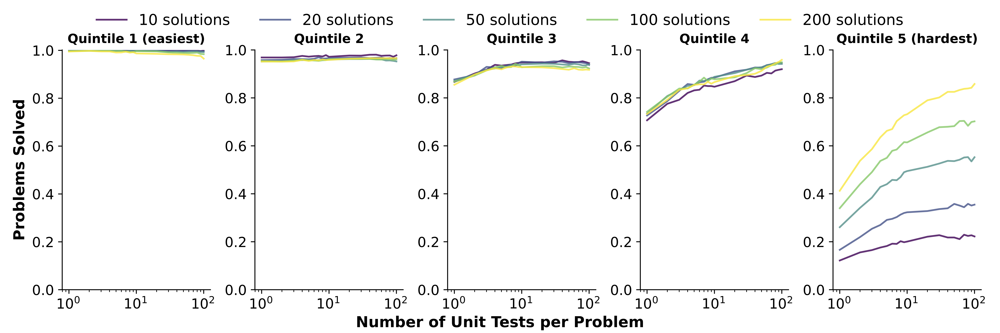

# Dynamic Scaling of Unit Tests for Code Reward Modeling




<p align="center">
  <a href="https://code-reward-model.github.io/">[🏠 Homepage]</a> 
  |<a href="https://arxiv.org/abs/2501.01054">[📄 arXiv]</a> |
<a href="https://huggingface.co/datasets/KAKA22/CodeRM-UnitTest">[📊 Dataset]</a> |
<a href="https://huggingface.co/KAKA22/CodeRM-8B">[📦 Model]</a> |
  <a href="https://github.com/RUCKBReasoning/CodeRM">[💻 Code]</a> 
</p>
<hr>

## 🔔 News

[2025-01] 🔥 We have open-sourced the unit test generator, training dataset, Docker environment for efficient large-scale code execution, and the code for inference, preprocessing, and evaluation.

## Introduction

We explore the impact of scaling unit tests to enhance code reward signal quality across different LLMs and unit test scales. The result reveals a positive correlation between the number of unit tests and reward signal quality, with greater benefits observed in more challenging problems.

In light of these observations, we train a lightweight yet effective unit test generator named **CodeRM-8B** and employ dynmaic scaling over problem of different difficulties to facilitate efficient and high-quality unit test scaling. Experimental results show that our approach significantly improves performance across various models on three benchmarks (e.g., with gains of 18.43% for Llama3-8B and 3.42% for GPT-4o-mini on HumanEval Plus).

## Model

CodeRM-8B is a small yet powerful model designed to enable efficient and high-quality unit test generation.  It is trained on a dataset of 60k high-quality synthetic Python unit tests using Llama3.1-70B-Instruct.  These unit tests are synthesized based on two well-regarded code instruction tuning datasets: [CodeFeedback-Filtered-Instruction](https://huggingface.co/datasets/m-a-p/CodeFeedback-Filtered-Instruction) and the training set of [TACO](https://huggingface.co/datasets/BAAI/TACO). The training dataset used for unit test generation is openly available under 
[CodeRM-UnitTest](https://huggingface.co/datasets/KAKA22/CodeRM-UnitTest).

**Prompt Format:**

```
Below is a question and it's corresponding code answer. Please write test cases to check the correctness of the code answer. You need to use the unittest library in Python and create a test class for testing.

### question
{question}

### code solution
{code in function format}

Please add detailed comments to the test cases you write. You do not need to test the function's ability to throw exceptions.
```

## Performance

### Best-of-N

First, we evaluate the performance of CodeRM-8B using a best-of-N setting. In this setup, an LLM (policy model) generates
100 candidate code solutions for a given programming problem, while another LLM (reward model) generates 100 unit 
tests. The optimal code solution is then selected based on majority voting derived from the execution results 
of these unit tests.

Under this framework, our trained unit test generator demonstrates performance comparable to Llama3.1-70B-Instruct,
despite having an 8x smaller parameter size. The detailed evaluation results across three well-known benchmarks 
are as follows:

| Model | Policy: Llama3-8B | Policy: Llama3-70B | Policy: GPT-3.5 | Policy: GPT-4o-mini |
| :------ | :------ | :------ | :------ | :------ |
| **Benchmark: HumanEval Plus** |||||
| Vanilla | 53.58 | 73.74 | 67.83 | 82.96 |
| Reward: Llama3.1-8B | 66.84 (+13.26) | 77.14 (+3.40) | 76.32 (+8.49) | 83.11 (+0.15) |
| Reward: Llama3.1-70B | **72.04 (+18.46)** | <u>78.54 (+4.80</u>) | **79.76 (+11.93)** | <u>85.45 (+2.49</u>) |
| Reward: CodeRM-8B | <u>72.01 (+18.43</u>) | **78.69 (+4.95)** | <u>78.01 (+10.18</u>) | **86.38 (+3.42)** |
| **Benchmark: MBPP Plus** |||||
| Vanilla | 49.20 | 69.33 | 70.53 | 71.59 |
| Reward: Llama3.1-8B | 64.31 (+15.11) | 71.64 (+2.31) | 74.18 (+3.65) | 74.48 (+2.89) |
| Reward: Llama3.1-70B | <u>65.26 (+16.06</u>) | <u>71.85 (+2.52</u>) | <u>75.72 (+5.19</u>) | <u>74.96 (+3.37</u>) |
| Reward: CodeRM-8B | **66.71 (+17.51)** | **72.44 (+3.11)** | **75.96 (+5.43)** | **75.20 (+3.61)** |
| **Benchmark: LiveCodeBench** |||||
| Vanilla | 11.98 | 25.30 | 20.55 | 34.83 |
| Reward: Llama3.1-70B | <u>13.28 (+1.30</u>) | **28.46 (+3.16)** | **22.80 (+2.25)** | <u>38.60 (+3.77</u>) |
| Reward: CodeRM-8B | **15.21 (+3.23)** | <u>27.73 (+2.43</u>)| <u>21.76 (+1.21</u>) | **39.20 (+4.37)** |

### Quality of Unit Test

We evaluate the quality of the unit test generated by CodeRM-8B. As each unit test functions as a classifier to 
determine correct or incorrect solutions, we first utilize accuracy and F1 score as metrics to assess the 
classification performance of the unit test. 

We further propose two new metrics to detailed evaluate the possibility of the unit test making incorrect judgments.
False Acceptance Rate (FAR) measures the probability of wrong solutions being accepted by unit tests.
False Rejection Rate (FRR) measures the probability of correct solutions being rejected by unit tests.
The calculation formulas for these four metrics are introduced in Appendix D of the paper.

Below is the quality of individual unit tests and the combination of multiple unit tests on HumanEval Plus, 
utilizing Llama3.1-8B as the policy model. The top two performances are marked in **bold** and _underlined_.

| **Model**           | **Acc (↑)**   | **F1 (↑)**    | **FAR (↓)**   | **FRR (↓)**   |
|----------------------|---------------|---------------|---------------|---------------|
| **Quality of Individual Unit Tests** |               |               |               |               |
| Llama3.1-8B         | 60.02         | 44.97         | 13.66         | 46.13         |
| Llama3.1-70B        | **73.65**     | **70.15**     | **11.10**     | **34.51**     |
| *CodeRM-8B (Ours)*      | <u>69.64</u>       | <u>63.63</u>       | <u>11.17</u>       | <u>38.55</u>       |
| **Quality of Multiple Unit Tests** |               |               |               |               |
| Llama3.1-8B         | 74.21         | 74.35         | 20.44         | 30.55         |
| Llama3.1-70B        | <u>78.30</u>       | <u>78.76</u>       | <u>17.19</u>       | <u>25.97</u>       |
| *CodeRM-8B (Ours)*      | **80.46**     | **81.27**     | **16.48**     | **22.71**     |

## Reproduction

### File Structure

Below are the core files for reproducing our experiments or employing CodeRM-8B.

```
CodeRM/
│
├── data/                     # The benchmark and inference result of our experiments.
│   ├── benchmark/            # The benchmark data.
│   ├── result/               # The generated solution and unit test based on benchmark.
│
├── inference/                # The code for generating code solution and unit test.
│   ├── config.json           # The configuration for inference.
│   └── inference_mp.py       # The code for multi-process inference.
│
├── preprocess/               # The code for prerocessing results after inference.
│   ├── merge_output.py       # Merge the output of each process after multi-process inference.
│   ├── extract_solution.py   # Extract solution for inference result.
│   └── extract_unit_test.py  # Extract unit test for inference result.
│
├── evaluation/               # The code for code execution and calculate best-of-n accuracy.
│   ├── evaluate.py           # Execute unit test on code solution and obtain the result.
│   └── calculate_result.py   # Calculate the best-of-n accuracy based on majority voting. 
│
└── docker_source/            # The source code of the code execution environment.
```

### Reproduction Guide

#### Step 1: Multi-Process Inference

We provide a Python script for multi-process inference to improve efficiency. First, modify the configuration file located at `inference/config.json` as needed. Then, run the following command:

```bash
cd inference
python inference_mp.py --config config.json
```

#### Step 2: Preprocessing Inference Results

After running the inference script, you need to preprocess the output to obtain either code solutions or unit tests. Since the inference uses multiple processes, you must merge the results from all processes:

```bash
cd preprocess
python merge_output.py --mp_num MP_NUM --input_dir INPUT_DIR
```

Next, extract the desired outputs:

- To extract **code solutions**, run:

  ```bash
  python extract_solution.py --data_path DATA_PATH --id_path ID_PATH --output_path OUTPUT_PATH
  ```

- To extract **unit tests**, run:

  ```bash
  python extract_unit_test.py --data_path DATA_PATH --id_path ID_PATH --output_path OUTPUT_PATH
  ```

#### Step 3: Executing Unit Tests

To execute the generated unit tests efficiently, we provide a prebuilt Docker image. Pull the Docker environment using the following command:

```bash
docker pull kaka0605/exec_unit_test:24.12.30
```

You can also build the Docker by yourself:

```
cd docker_source
docker buildx build --platform linux/amd64 -t kaka0605/exec_unit_test:24.12.30 --load .
```

Once the setup is complete, execute the unit tests on the generated code solutions:

```bash
python evaluation/evaluate.py --benchmark BENCHMARK --sol_model SOL_MODEL --ut_model UT_MODEL --sol_num SOL_NUM --ut_num UT_NUM --mp_num MP_NUM
```

Alternatively, you can directly use the execution results provided by us. Download the `output.tar.gz` file from [Google Drive](https://drive.google.com/drive/folders/1-wUvy9Ox49V5CY38TMjCr5RlLysapyyj?usp=sharing), and replace the corresponding output file in the repository.

#### Step 4: Performance Evaluation

Finally, calculate the **best-of-n** performance using a majority voting framework. Run the following command:

```bash
python evaluation/calculate_result.py --benchmark BENCHMARK --sol_model SOL_MODEL --ut_model UT_MODEL --sol_num SOL_NUM --ut_num UT_NUM --sample_num SAMPLE_NUM
```

## Citation

If you find our dataset helpful, please cite the original paper:
```
@misc{ma2025coderm,
      title={Dynamic Scaling of Unit Tests for Code Reward Modeling}, 
      author={Zeyao Ma and Xiaokang Zhang and Jing Zhang and Jifan Yu and Sijia Luo and Jie Tang},
      year={2025},
      eprint={2501.01054},
      archivePrefix={arXiv},
      primaryClass={cs.CL},
      url={https://arxiv.org/abs/2501.01054}, 
}
```

## Contact

If you have any problems, feel free to raise an issue or reach out to us via email at: <zeyaoma@gmail.com>.
